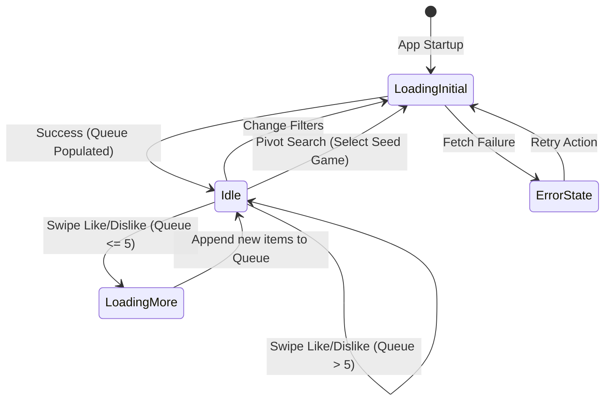

# Data Model: Game Recommendation Tinder SPA

This document defines the core data structures and state definitions for the game recommendation application.

## Core Entities

### 1. GameCard
Represents the normalized game details displayed to the user in the Tinder card interface.

| Field | Type | Description | Validation / Constraints |
|---|---|---|---|
| `id` | number | Unique identifier (from RAWG API) | Must be positive |
| `name` | string | Full title of the game | Must be non-empty |
| `slug` | string | URL-friendly name identifier | Must match alphanumeric + dashes format |
| `backgroundImage` | string | URL of the main display image | Must be a valid URL string or placeholder fallback |
| `rating` | number | Average rating score from RAWG | Float between `0.0` and `5.0` |
| `released` | string | Date of release | ISO date format `YYYY-MM-DD` or "Unknown" |
| `genres` | string[] | Array of genre names associated with the game | Array size >= 0 |
| `platforms` | string[] | Array of platform names supporting the game | Array size >= 0 |
| `shortDescription` | string | Brief description or tagline | Can be empty, strip HTML tags |

### 2. FilterConfiguration
Represents the query criteria currently applied to the recommendation query.

| Field | Type | Description | Default Value |
|---|---|---|---|
| `genres` | string[] | Selected genre slugs/IDs to filter recommendations | `[]` (All genres) |
| `platforms` | string[] | Selected platform IDs to filter recommendations | `[]` (All platforms) |
| `freeToPlay` | boolean | If true, only recommend free games | `false` |

### 3. SwipeSessionState
Represents the interactive state tracking the active swiping queue and historical decisions in React state.

| State Field | Type | Description |
|---|---|---|
| `queue` | GameCard[] | In-memory buffer list of games currently queued for display |
| `likedList` | GameCard[] | List of games the user swiped right ("Like") |
| `dislikedList` | GameCard[] | List of games the user swiped left ("Dislike") |
| `currentSeed` | GameCard \| null | The game selected as the current search seed for recommendation pivoting |
| `activeFilters` | FilterConfiguration | Current active genre, platform, and free-to-play options |
| `isLoading` | boolean | API pending state status flag |
| `error` | string \| null | Contains API error message if API fails |

---

## State Transition Workflow

The state machine for the swiping queue handles card swipes, filter changes, and search pivoting.

### Transition Actions:
1. **Swipe Action (Like/Dislike)**:
   - Removes the head element of `queue`.
   - Appends swiped card to `likedList` or `dislikedList` accordingly.
   - If `queue.length <= 5`, triggers an asynchronous background page fetch to query RAWG and appends new normalized games to the end of the `queue` array.
2. **Apply Filters**:
   - Updates `activeFilters`.
   - Clears `queue`.
   - Clears `currentSeed`.
   - Fetches page 1 of new recommendations matching filters, then populates `queue`.
3. **Pivot Search**:
   - Sets `currentSeed` to the active `GameCard`.
   - Clears `queue`.
   - Fetches recommendations using genres/tags of the `currentSeed` as query parameters, then populates `queue`.
