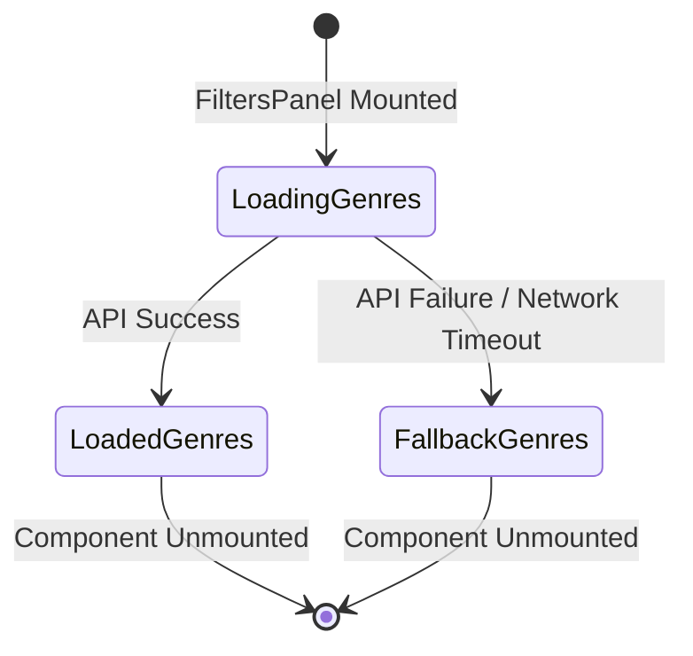

# Data Model: Dynamic Genre Filter

This document defines the core data schemas and states used in fetching and rendering dynamic game genres.

## Core Entities

### 1. Genre
Represents a game genre entity returned from the RAWG API and mapped to the dropdown elements.

| Field | Type | Description | Constraints |
|---|---|---|---|
| `id` | number | Unique genre identifier | Must be positive |
| `name` | string | Display label of the genre (e.g. "Action") | Must be non-empty |
| `slug` | string | URL-friendly keyword used for filtering queries | Must be non-empty |

---

## State Transition Workflow

The state of the genres list inside the filters panel transitions through loading, success, or fallback states.

### Transition States:
1. **LoadingGenres**:
   - `genresList` is empty `[]`.
   - `isLoading` is set to `true`.
   - Select element shows "Carregando gêneros..." option and is disabled.
2. **LoadedGenres**:
   - `genresList` contains the full array of normalized `Genre` objects.
   - `isLoading` is set to `false`.
   - Select element is enabled and populated with the full list.
3. **FallbackGenres**:
   - `genresList` is populated with a static local backup list of primary genres.
   - `isLoading` is set to `false`.
   - `error` logs the API fetch failure, but select element is enabled using the backup list.
