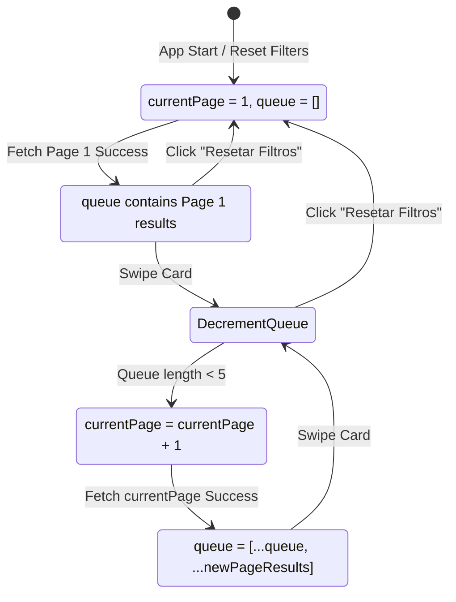

# Data Model & Transitions: Pagination & Docs

This document outlines the pagination state properties and state machine rules for infinite card queue filling.

## Core State Entities

### 1. PaginationState
Extended state inside `useGameSwiper.js` hook to control catalog offsets.

| State Field | Type | Description | Default Value |
|---|---|---|---|
| `currentPage` | number | The current page number index to request from RAWG API | `1` |

---

## State Transition Workflow

The swiping queue state machine controls page transitions and filter resets.

